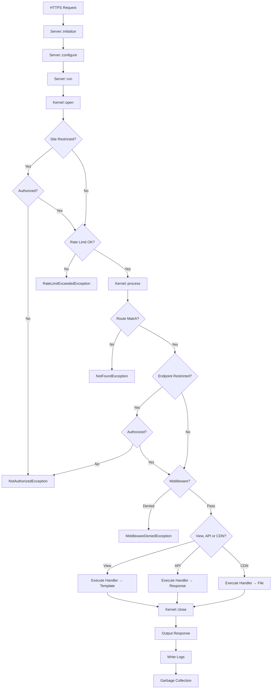

# FastRaven Framework Documentation

**FastRaven** is a lightweight PHP framework for building monolithic applications with clean API/view separation, built-in authentication, database operations, caching, validation, and email.

### Key Features

| Feature | Description |
|---------|-------------|
| 🚀 Fast & Fluent | Zero-config setup, chainable methods, minimal overhead |
| 🔒 Security | CSRF protection, session management, CSP, HSTS |
| 🛣️ Routing | O(1) hash map lookup, separate API/View/CDN routers |
| 🔐 Auth | Session-based with automatic CSRF validation |
| 📊 Database | PDO with prepared statements, SQL injection protection |
| ⚡ Caching | APCu → shmop → file fallback with auto-selection |
| 🎨 Templates | Fragments, data passing, asset versioning |
| 🎯 Middlewares | Per-endpoint request control |
| ✅ Validation | Email, password, username, age, phone |
| 📧 Email | PHPMailer with templates and attachments |
| 📁 Files | Secure uploads with MIME validation via magic bytes |
| 📝 Logging | Request logging with debug/warn/error levels |

---

## 1. Request Lifecycle



### Execution Order Summary

1. **Server::initialize()** - Validates skeleton structure, loads `.env` files
2. **Server::configure()** - Creates Kernel with Config, Template, Middleware, and Routers
3. **Server::run()** - Main execution loop
4. **Kernel::open()** - Initializes Request, Workers/Slaves, handles site-level auth
5. **Kernel::process()** - Rate limiting, route matching, middleware execution, endpoint execution
6. **Kernel::close()** - Sends response, writes logs, garbage collection


---

## 2. Skeleton Structure

```
skeleton/
├── docs/                     Documentation
├── ops/                      Operations (scripts, etc.)
├── shared/                   Shared classes (Shared\ namespace)
└── sites/main/
    ├── config/
    │   ├── env/              .env, .env.dev, .env.prod
    │   ├── router/           views.php, api.php, cdn.php
    │   ├── config.php        Main configuration
    │   ├── template.php      Default template
    │   └── middleware.php    Middleware definitions
    ├── src/
    │   ├── api/              API endpoint handlers
    │   ├── cdn/              CDN endpoint handlers
    │   ├── views/            View endpoint handlers
    │   └── web/
    │       ├── templates/    pages/, fragments/, mails/
    │       └── assets/       scss/, js/ (compiled via watch.sh)
    ├── public/assets/        css/, js/, img/, fonts/ (compiled output)
    ├── storage/              cache/, logs/, uploads/
    └── index.php             Entry point
```

---

## 3. Entry Point & Configuration

### index.php

The entry point initializes the server, configures it, and starts processing:

```php
<?php

declare(strict_types=1);
require __DIR__ . "/../../vendor/autoload.php";

use FastRaven\Server;

// Server initialization. sitePath SHOULD ALWAYS BE __DIR__
$server = Server::initialize(__DIR__);

// Server configuration
$server->configure(
    Server::getConfiguration(),
    Server::getTemplate(),
    Server::getMiddleware(),
    Server::getViewRouter(),
    Server::getApiRouter(),
    Server::getCdnRouter()
);

// Start request processing
$server->run();
```

---

### config.php

Main configuration for the site:

```php
<?php

use FastRaven\Components\Core\Config;

// Main Configuration. siteName is for identification, restricted = require auth for all pages
$config = Config::new("main", false);

// Cookie Session Configuration
// @param sessionName - Cookie name for session
// @param expiryDays - Session lifetime in days
// @param globalAuth - Share auth across subdomains (uses parent domain cookie)
$config->configureAuthorization("YOURSESSIONNAME", 7, false);

// Redirect settings
// @param notFoundPath - Path to redirect on 404
// @param unauthorizedPath - Path to redirect on 401
// @param unauthorizedSubdomain - Subdomain redirect (empty = main domain)
$config->configureRedirects("/", "/login", "");

// Privacy settings
// @param registerLogs - Enable request logging
// @param registerOrigin - Log IP addresses
$config->configurePrivacy(true, true);

// Rate limiting per middleware type (requests per minute, -1 = disabled)
$config->configureRateLimits(200, 200, 200);

// Input/file size limits in KB (-1 = disabled)
$config->configureLengthLimits(256, 5120);

// Cache garbage collection
// @param gcProbability - Probability % to run GC (0 = disabled)
// @param gcPower - Number of files to check per GC run
$config->configureCache(1, 50);

return $config;
```

---

### template.php

Default template for all views:

```php
<?php

use FastRaven\Components\Core\Template;
use FastRaven\Workers\Bee;

// Default template for all views.
$template = Template::new("main.php", "Fast Raven Site", Bee::env("VERSION", "0.0.1"));
$template->setFavicon("favicon.png")
         ->setBeforeFragments(["header.php"])
         ->addStyle("style.css")
         ->addScript("main.js");

return $template;
```

**Template Methods:**

| Method | Description |
|--------|-------------|
| `new(file, title, version)` | Create new template |
| `setFile/setTitle/setVersion` | Setters with chaining |
| `setFavicon(filename)` | Set favicon for both light/dark mode |
| `setFaviconLight/setFaviconDark(filename)` | Set mode-specific favicons |
| `addStyle(filename)` | Add CSS file from public/assets/css/ |
| `addScript(filename)` | Add JS file from public/assets/js/ |
| `setBeforeFragments(array)` | Fragments to render before main content |
| `setAfterFragments(array)` | Fragments to render after main content |
| `addData(Item)` | Add data for template rendering |
| `getData(key)` | Get data value by key |
| `hasData(key)` | Check if data key exists |
| `merge(?Template)` | Merge another template (overwrites non-empty values) |

---

### middleware.php

Middleware are reusable functions that can be attached to individual endpoints:

```php
<?php

use FastRaven\Workers\LogWorker;
use FastRaven\Components\Http\Request;
use FastRaven\Components\Routing\Middleware;

// Create a new middleware holder instance.
$middleware = Middleware::new();

// Add middleware with a unique ID
$middleware->add("alwaysPass", function(Request $request): bool {
    LogWorker::log("Middleware executed for request");
    return true; // Return false to deny request (throws MiddlewareDeniedException)
});

$middleware->add("requireAdmin", function(Request $request): bool {
    // Example: Check if user has admin role
    // $userId = AuthWorker::getAuthorizedUserId();
    // return $userId && isAdmin($userId);
    return true;
});

return $middleware;
```

**Middleware Signature:**
- `function(Request $request): bool`
- Return `false` to deny request (throws `MiddlewareDeniedException`)

---

### Router Files

#### views.php (View Router)

```php
<?php

use FastRaven\Components\Routing\{Endpoint, Router};
use FastRaven\Types\EndpointType;

// View Router configuration. Each view must return a Template.
$viewRouter = Router::new(EndpointType::VIEW)
    ->add(Endpoint::view(false, "/", "Home.php"))
    ->add(Endpoint::view(true, "/dashboard", "Dashboard.php"))  // Restricted
    ->add(Endpoint::view(false, "/ping", "Ping.php", "alwaysPass"));  // With middleware

return $viewRouter;
```

#### api.php (API Router)

```php
<?php

use FastRaven\Components\Routing\{Endpoint, Router};
use FastRaven\Types\EndpointType;

// API Router - /api/ prefix is automatically added
$apiRouter = Router::new(EndpointType::API, 200)  // Rate limit: 200 req/min
    ->add(Endpoint::api(false, "GET", "/health", "Health.php"))
    ->add(Endpoint::api(false, "GET", "/pong", "Pong.php"))
    ->add(Endpoint::api(true, "POST", "/user/update", "user/Update.php"))  // Restricted
    ->add(Endpoint::api(false, "POST", "/login", "auth/Login.php", "guestOnly"));  // With middleware

return $apiRouter;
```

#### cdn.php (CDN Router)

```php
<?php

use FastRaven\Components\Routing\{Endpoint, Router};
use FastRaven\Types\EndpointType;

// CDN Router - /cdn/ prefix is automatically added
$cdnRouter = Router::new(EndpointType::CDN)
    ->add(Endpoint::cdn(false, "GET", "/favicon", "Favicon.php"));

return $cdnRouter;
```

---

### Endpoint Factory Methods

| Method | Signature | Description |
|--------|-----------|-------------|
| `view()` | `(restricted, path, file, ?middlewareId)` | View endpoint (returns Template) |
| `api()` | `(restricted, method, path, file, ?middlewareId)` | JSON API endpoint |
| `cdn()` | `(restricted, method, path, file, ?middlewareId)` | Binary/file endpoint |
| `router()` | `(type, restricted, path, routerFile, ?middlewareId)` | Nested router |

**Parameters:**
- `restricted` - Require authentication
- `middlewareId` - Optional ID of middleware to run before endpoint

**Router Constructor:**
- `Router::new(EndpointType $type, int $limitPerMinute = -1)` - Rate limiting is now set at the router level

---

## 4. Environment Variables

```bash
# .env (shared across environments)
STATE=dev                    # "dev" or "prod"
VERSION=1.0.0

# .env.dev / .env.prod (environment-specific)
SITE_ADDRESS=example.com     # Base domain
AUTH_DOMAIN=.example.com     # Cookie domain (with leading dot for subdomains)

# Database
DB_HOST=localhost
DB_NAME=app
DB_USER=root
DB_PASS=secret
DB_PERSISTENT=true           # Use persistent connections
DB_SSL=false                 # Enable SSL for DB connection

# Email (PHPMailer)
SMTP_HOST=smtp.example.com
SMTP_PORT=587
SMTP_USER=mail@example.com
SMTP_PASS=secret
```

---

## 5. Workers (Public API)

Workers are the public API for interacting with framework functionality.

### Bee (Utilities)

```php
use FastRaven\Workers\Bee;

// Environment
$host = Bee::env("DB_HOST", "localhost");  // Get env var with default
$isDev = Bee::isDev();                     // Check if STATE === "dev"

// Paths
$path = Bee::buildProjectPath(ProjectFolderType::CONFIG, "config.php");
$safe = Bee::normalizePath("../etc/passwd");  // → "etc/passwd"

// Security
$hash = Bee::hashPassword("secret");          // Argon2ID hashing

// Files
$mime = Bee::getFileMimeType("/path/to/file");           // Returns MIME string
$type = Bee::getFileMimeType("/path/to/file", true);     // Returns DataType enum

// Domain
$domain = Bee::getBaseDomain();                  // From SITE_ADDRESS
$full = Bee::getBuiltDomain("admin");            // "admin.example.com"

// Callable validation
$valid = Bee::validateCallable($callable, [Request::class, Template::class]);
```

---

### AuthWorker

```php
use FastRaven\Workers\AuthWorker;

// Create session
AuthWorker::createAuthorization($userId, ["role" => "admin"]);

// Check authorization
AuthWorker::isAuthorized($request);      // Includes CSRF check for POST/PUT/DELETE/PATCH
AuthWorker::isAuthorized();              // Session only (no CSRF check)
$userId = AuthWorker::getAuthorizedUserId();  // int or null

// Destroy session
AuthWorker::destroyAuthorization();

// Regenerate CSRF token (invalidates other tabs)
$newToken = AuthWorker::regenerateCSRF();

// Auto-login from database
AuthWorker::autologin(
    $username, 
    $password, 
    "users",      // table
    "id",         // id column
    "username",   // username column
    "password"    // password column (Argon2ID hashed)
);
```

**Session Variables:**
- `$_SESSION["sgas_uid"]` - User ID
- `$_SESSION["sgas_custom"]` - Custom data array
- `$_SESSION["sgas_csrf"]` - CSRF token

---

### DataWorker

> ⚠️ Only `Collection` values are protected via prepared statements. Never use user input for table/column names.

```php
use FastRaven\Workers\DataWorker;
use FastRaven\Components\Data\{Collection, Item};

// Read single row
$user = DataWorker::getOneById("users", ["id", "name"], 1);
$user = DataWorker::getOneWhere("users", ["*"], Collection::new([
    Item::new("email", $email)
]));

// Read multiple rows
$users = DataWorker::getAllWhere(
    "users", 
    ["id", "name"], 
    Collection::new([Item::new("active", 1)]),
    "name ASC",  // orderBy
    10,          // limit
    0            // offset
);
$allUsers = DataWorker::getAll("users", ["*"], "created_at DESC", 100, 0);

// Insert
DataWorker::insert("users", Collection::new([
    Item::new("name", "John"),
    Item::new("email", "john@example.com")
]));
$id = DataWorker::getLastInsertId();

// Batch insert (single transaction)
DataWorker::insertBatch("logs", [
    Collection::new([Item::new("action", "login")]),
    Collection::new([Item::new("action", "logout")])
]);

// Update
DataWorker::updateById("users", 1, Collection::new([
    Item::new("name", "Jane")
]));
DataWorker::updateWhere("users", 
    Collection::new([Item::new("active", 0)]),
    Collection::new([Item::new("old", 1)])
);

// Delete
DataWorker::deleteById("users", 1);
DataWorker::deleteWhere("users", Collection::new([Item::new("expired", 1)]));

// Count/Exists
$count = DataWorker::count("users", Collection::new([Item::new("active", 1)]));
$exists = DataWorker::existsById("users", 1);
```

---

### ValidationWorker

```php
use FastRaven\Workers\ValidationWorker;
use FastRaven\Components\Data\ValidationFlags;

// Email validation
ValidationWorker::email($email);  // Uses filter_var

// Password validation
ValidationWorker::password($password, ValidationFlags::password(
    minLength: 8,
    maxLength: 128,
    minNumber: 1,
    minSpecial: 1,
    minLowercase: 1,
    minUppercase: 1
));

// Age validation
ValidationWorker::age($age, ValidationFlags::age(
    minAge: 18,
    maxAge: 120
));

// Username validation
ValidationWorker::username($username, ValidationFlags::username(
    minLength: 3,
    maxLength: 20
));

// Phone validation
ValidationWorker::phone($countryCode, $phone);  // 7-15 chars, code 1-999
```

---

### CacheWorker

Automatically selects best backend: APCu → shmop → file.

```php
use FastRaven\Workers\CacheWorker;

CacheWorker::write("key", $value, 3600);  // TTL in seconds
$value = CacheWorker::read("key");        // null if expired/missing
CacheWorker::remove("key");
CacheWorker::increment("counter", 1);     // Atomic increment
CacheWorker::empty();                     // Clear all cache
```

---

### FileWorker

Manages files in `storage/uploads/`.

```php
use FastRaven\Workers\FileWorker;

// Upload (from Request)
$file = $request->file("avatar");  // Returns File object
FileWorker::upload($file, "avatars/user_123.jpg");

// Read/Check/Delete
$content = FileWorker::read("documents/file.txt");
$exists = FileWorker::exists("path/to/file");
FileWorker::delete("path/to/file");

// Get full path
$fullPath = FileWorker::getUploadFilePath("path/to/file");
```

---

### LogWorker

Logs to `storage/logs/YYYY-MM-DD.log`.

```php
use FastRaven\Workers\LogWorker;

LogWorker::log("User logged in");        // Normal log
LogWorker::warning("Invalid input");     // //WARN// prefix
LogWorker::error("Database failed");     // //ERROR// prefix
LogWorker::debug("Debug info");          // /SG/ prefix, dev only
```

---

### MailWorker

Sends emails using PHPMailer with SMTP. Configure SMTP settings in `.env`.

```php
use FastRaven\Workers\MailWorker;
use FastRaven\Components\Core\Mail;
use FastRaven\Components\Data\{Collection, Item};

$mail = Mail::new(
    Item::mail("Site", "noreply@example.com"),   // From
    Item::mail("User", "user@example.com"),      // To
    "Welcome!",                                  // Subject
    "welcome.php"                                // Template in src/web/templates/mails/
);

$mail->setReplaceValues(Collection::new([
    Item::new("{{NAME}}", "John"),
    Item::new("{{LINK}}", "https://example.com/verify")
]));

// Optional: Add BCC recipients
$mail->setBccMails(Collection::new([
    Item::mail("Admin", "admin@example.com")
]));

// Optional: Add attachments (relative to storage/uploads/)
$mail->setAttachments(Collection::new([
    Item::new("report.pdf", "documents/report.pdf")
]));

// Optional: Set timeout (default 3000ms)
$mail->setTimeout(5000);

MailWorker::sendMail($mail);
```

**Mail Templates:**
- Location: `src/web/templates/mails/`
- Format: HTML files with placeholder support (e.g., `{{PLACEHOLDER}}`)
- Placeholders are replaced using `setReplaceValues()`

---

### HeaderWorker

```php
use FastRaven\Workers\HeaderWorker;

HeaderWorker::addHeader("X-Custom", "value");
HeaderWorker::removeHeader("X-Custom");
```

**Auto-set security headers:** CSP, HSTS, X-Frame-Options, X-Content-Type-Options, Referrer-Policy.

---

## 6. Components

### Request

```php
$request->getType();              // EndpointType::VIEW/API/CDN
$request->getMethod();            // GET, POST, PUT, DELETE, PATCH
$request->getPath();              // /api/users/
$request->getComplexPath();       // /api/users/#POST (for routing)
$request->getInternalID();        // 8-char hex request ID
$request->getRemoteAddress();     // Client IP

// Query params (?key=value)
$value = $request->get("key", SanitizeType::SAFE);

// Body params (JSON or form data)
$value = $request->post("key", SanitizeType::SANITIZED);

// File uploads
$file = $request->file("avatar");  // Returns File object or null
```

---

### Response

```php
// Standard JSON response
Response::new(true, 200, "Success", ["id" => 1]);
Response::new(false, 400, "Invalid input");

// File response (for CDN endpoints)
Response::file(true, "path/in/uploads");  // Relative to storage/uploads/

// Chained setters
Response::new(true, 200)
    ->setMessage("Updated")
    ->setData(["count" => 5])
    ->setDataType(DataType::JSON);
```

**JSON output format:**
```json
{
    "success": true,
    "msg": "Success",
    "data": {"id": 1}
}
```

---

### Collection & Item

O(1) hash map for type-safe key-value pairs:

```php
use FastRaven\Components\Data\{Collection, Item};

$collection = Collection::new([
    Item::new("email", "john@example.com"),
    Item::new("name", "John")
]);

// Add/Get/Set/Remove
$collection->add(Item::new("age", 25));
$item = $collection->get("email");      // Item or null
$value = $item->getValue();             // "john@example.com"
$collection->set("email", Item::new("email", "jane@example.com"));
$collection->remove("age");

// Special factory for mail
$mailItem = Item::mail("John Doe", "john@example.com");
```

---

### File

Represents an uploaded file from request:

```php
use FastRaven\Components\Core\File;

$file = $request->file("avatar");  // Returns File or null

// Properties
$file->getPath();       // Temporary path (e.g., /tmp/phpXXXX)
$file->getName();       // Original filename (e.g., "photo.jpg")
$file->getExtension();  // File extension (e.g., "jpg")

// Usage with FileWorker
FileWorker::upload($file, "avatars/" . $file->getName());
```

---

### Mail

Email configuration for MailWorker:

```php
use FastRaven\Components\Core\Mail;
use FastRaven\Components\Data\{Collection, Item};

$mail = Mail::new(
    Item::mail("Site Name", "noreply@example.com"),  // From
    Item::mail("User Name", "user@example.com"),     // To
    "Welcome to our site!",                          // Subject
    "welcome.php"                                    // Template in src/web/templates/mails/
);

// All available setters (chainable)
$mail
    ->setOrigin(Item::mail("New Sender", "new@example.com"))
    ->setDestination(Item::mail("New Recipient", "recipient@example.com"))
    ->setSubject("Updated Subject")
    ->setBodyFile("other-template.html")
    ->setReplaceValues(Collection::new([
        Item::new("{{NAME}}", "John"),
        Item::new("{{LINK}}", "https://example.com/verify")
    ]))
    ->setBccMails(Collection::new([
        Item::mail("Admin", "admin@example.com"),
        Item::mail("Manager", "manager@example.com")
    ]))
    ->setAttachments(Collection::new([
        Item::new("invoice.pdf", "/path/to/invoice.pdf")
    ]))
    ->setTimeout(5000);  // Timeout in ms (default: 3000)
```

---

### ValidationFlags

Factory class for validation rules:

```php
use FastRaven\Components\Data\ValidationFlags;

// Email flags
ValidationFlags::email(
    minLength: 5,    // Default: 0
    maxLength: 255   // Default: 255
);

// Password flags
ValidationFlags::password(
    minLength: 8,      // Default: 0
    maxLength: 128,    // Default: 255
    minNumber: 1,      // Default: 0
    minSpecial: 1,     // Default: 0
    minLowercase: 1,   // Default: 0
    minUppercase: 1    // Default: 0
);

// Age flags
ValidationFlags::age(
    minAge: 18,   // Default: 12
    maxAge: 120   // Default: 120
);

// Username flags
ValidationFlags::username(
    minLength: 3,    // Default: 0
    maxLength: 20    // Default: 255
);
```

**Usage with ValidationWorker:**
```php
if (!ValidationWorker::password($pass, ValidationFlags::password(8, 128, 1, 1, 1, 1))) {
    return Response::new(false, 400, "Password must be 8+ chars with uppercase, lowercase, number, and special char");
}
```

---

## 7. Types (`FastRaven\Types`)

### ProjectFolderType

Used with `Bee::buildProjectPath()` for type-safe path construction.

| Case | Path |
|------|------|
| `CONFIG` | `config/` |
| `CONFIG_ENV` | `config/env/` |
| `CONFIG_ROUTER` | `config/router/` |
| `PUBLIC` | `public/` |
| `PUBLIC_ASSETS` | `public/assets/` |
| `PUBLIC_ASSETS_CSS` | `public/assets/css/` |
| `PUBLIC_ASSETS_JS` | `public/assets/js/` |
| `PUBLIC_ASSETS_IMG` | `public/assets/img/` |
| `PUBLIC_ASSETS_FONTS` | `public/assets/fonts/` |
| `SRC` | `src/` |
| `SRC_VIEWS` | `src/views/` |
| `SRC_API` | `src/api/` |
| `SRC_CDN` | `src/cdn/` |
| `SRC_WEB` | `src/web/` |
| `SRC_WEB_TEMPLATES` | `src/web/templates/` |
| `SRC_WEB_TEMPLATES_FRAGMENTS` | `src/web/templates/fragments/` |
| `SRC_WEB_TEMPLATES_MAILS` | `src/web/templates/mails/` |
| `SRC_WEB_TEMPLATES_PAGES` | `src/web/templates/pages/` |
| `SRC_WEB_ASSETS` | `src/web/assets/` |
| `SRC_WEB_ASSETS_SCSS` | `src/web/assets/scss/` |
| `SRC_WEB_ASSETS_JS` | `src/web/assets/js/` |
| `STORAGE` | `storage/` |
| `STORAGE_CACHE` | `storage/cache/` |
| `STORAGE_LOGS` | `storage/logs/` |
| `STORAGE_UPLOADS` | `storage/uploads/` |

---

### SanitizeType

Input sanitization levels (use with `$request->get()` / `$request->post()`):

| Level | Effect |
|-------|--------|
| `RAW` | No sanitization |
| `SAFE` | Strips null bytes, PHP tags |
| `ENCODED` | SAFE + `htmlspecialchars()` |
| `SANITIZED` | SAFE + `strip_tags()` |
| `ONLY_ALPHA` | SANITIZED + alphanumeric only |

---

### Other Enums

| Enum | Values |
|------|--------|
| `EndpointType` | VIEW, API, CDN, ROUTER |
| `CacheType` | APCU, SHARED, FILE |
| `QueryType` | SELECT, INSERT, UPDATE, DELETE, COUNT |
| `DataType` | 55+ MIME types (HTML, JSON, PNG, PDF, etc.) |

---

## 8. Exceptions

All exceptions extend `SmartException` with `getStatusCode()`, `getMessage()`, and `getPublicMessage()`.

| Exception | Code | Description |
|-----------|------|-------------|
| `SmartException` | - | Base class for all framework exceptions |
| `NotFoundException` | 404 | Route not found |
| `NotAuthorizedException` | 401 | Auth required |
| `NotAuthorizedException(true)` | 401 | Subdomain redirect |
| `BadMiddlewareException` | 500 | Middleware has incorrect signature |
| `MiddlewareDeniedException` | 400 | Middleware rejected request |
| `RateLimitExceededException` | 429 | Rate limit exceeded, includes Retry-After header |
| `BadImplementationException` | 500 | Endpoint doesn't return correct type |
| `EndpointFileNotFoundException` | 500 | Endpoint file missing |
| `UploadedFileNotFoundException` | 500 | Uploaded file not in tmp directory |
| `BadProjectSkeletonException` | 500 | Required project folder missing |
| `SecurityVulnerabilityException` | 500 | SQL injection detected |

---

## 9. View Endpoint Example

View endpoints now use PHP handler files that return a `Template` object:

```php
<?php
// src/views/Dashboard.php

use FastRaven\Components\Core\Template;
use FastRaven\Components\Http\Request;
use FastRaven\Components\Data\Item;
use FastRaven\Workers\AuthWorker;
use FastRaven\Workers\DataWorker;

return function(Request $request, Template $baseTemplate): Template {
    // Get user data
    $userId = AuthWorker::getAuthorizedUserId();
    $user = DataWorker::getOneById("users", ["name", "notifications"], $userId);
    
    // Create page-specific template
    $page = Template::new("dashboard.php", "Dashboard");
    
    // Add dynamic data for the template
    $page->addData(Item::new("username", $user["name"]));
    $page->addData(Item::new("notifications", $user["notifications"]));
    
    return $page;
};
```

**Template file** (`src/web/templates/pages/dashboard.php`):
```php
<h1>Welcome, <?= $template->getData("username") ?></h1>
<p>You have <?= $template->getData("notifications") ?> notifications</p>
```

**Handler Signature:**
- `function(Request $request, Template $baseTemplate): Template`
- `$baseTemplate` is the default template from `config/template.php`
- Return a new Template that will be merged with the base template

---

## 10. API Endpoint Example

Complete example of an API endpoint:

```php
<?php
// src/api/user/Update.php

use FastRaven\Components\Http\{Request, Response};
use FastRaven\Workers\{AuthWorker, DataWorker, ValidationWorker};
use FastRaven\Components\Data\{Collection, Item, ValidationFlags};
use FastRaven\Types\SanitizeType;

return function(Request $request): Response {
    // Get authenticated user
    $userId = AuthWorker::getAuthorizedUserId();
    if (!$userId) {
        return Response::new(false, 401, "Not authorized");
    }
    
    // Get and sanitize input
    $name = $request->post("name", SanitizeType::SANITIZED);
    $email = $request->post("email", SanitizeType::SAFE);
    
    // Validate input
    if (!ValidationWorker::username($name, ValidationFlags::username(3, 50))) {
        return Response::new(false, 400, "Invalid name");
    }
    if (!ValidationWorker::email($email)) {
        return Response::new(false, 400, "Invalid email");
    }
    
    // Check if email already exists
    $existing = DataWorker::getOneWhere("users", ["id"], Collection::new([
        Item::new("email", $email)
    ]));
    if ($existing && $existing["id"] !== $userId) {
        return Response::new(false, 409, "Email already in use");
    }
    
    // Update user
    DataWorker::updateById("users", $userId, Collection::new([
        Item::new("name", $name),
        Item::new("email", $email)
    ]));
    
    return Response::new(true, 200, "Profile updated");
};
```

---

## 11. CDN Endpoint Example

CDN endpoints serve files (images, documents, etc.) from storage:

```php
<?php
// src/cdn/Avatar.php

use FastRaven\Components\Http\{Request, Response};
use FastRaven\Workers\FileWorker;

return function(Request $request): Response {
    $userId = $request->get("id", SanitizeType::ONLY_ALPHA);
    
    if (!$userId) {
        return Response::new(false, 400, "Missing user ID");
    }
    
    $avatarPath = "avatars/user_{$userId}.jpg";
    
    if (!FileWorker::exists($avatarPath)) {
        return Response::file(true, "avatars/default.jpg");
    }
    
    return Response::file(true, $avatarPath);
};
```

**CDN router entry:**
```php
->add(Endpoint::cdn(false, "GET", "/avatar", "Avatar.php"))
// Access: GET /cdn/avatar/?id=123
```

---

## 12. Nested Router Example

For organizing large applications, use nested routers:

```php
// config/router/api.php (main router)
use FastRaven\Components\Routing\{Router, Endpoint};
use FastRaven\Types\EndpointType;

$apiRouter = Router::new(EndpointType::API)
    ->add(Endpoint::api(false, "GET", "/health", "Health.php"))
    // Nested router for all /api/admin/* endpoints
    ->add(Endpoint::router(EndpointType::API, true, "/admin", "admin.php"));

return $apiRouter;
```

```php
// config/router/admin.php (nested router)
use FastRaven\Components\Routing\{Router, Endpoint};
use FastRaven\Types\EndpointType;

// All endpoints here are already under /api/ and restricted
$adminRouter = Router::new(EndpointType::API)
    ->add(Endpoint::api(false, "GET", "/admin/users", "admin/Users.php"))
    ->add(Endpoint::api(false, "POST", "/admin/ban", "admin/Ban.php"));

return $adminRouter;
```

**Result:**
- `GET /api/admin/users/` → `admin/Users.php` (restricted)
- `POST /api/admin/ban/` → `admin/Ban.php` (restricted)

---

## 13. Error Handling

### Throwing Exceptions in Endpoints

```php
use FastRaven\Exceptions\NotFoundException;
use FastRaven\Exceptions\NotAuthorizedException;

return function(Request $request): Response {
    $id = $request->post("id", SanitizeType::ONLY_ALPHA);
    
    // 404 - Resource not found
    $item = DataWorker::getOneById("items", ["*"], intval($id));
    if (!$item) {
        throw new NotFoundException();
    }
    
    // 401 - Not authorized (redirects to login for views)
    if ($item["owner_id"] !== AuthWorker::getAuthorizedUserId()) {
        throw new NotAuthorizedException();
    }
    
    // 401 with subdomain redirect
    if ($item["requires_premium"]) {
        throw new NotAuthorizedException(true);  // Redirects to premium subdomain
    }
    
    return Response::new(true, 200, "OK", $item);
};
```

### Custom Error Responses

For API endpoints, return Response objects instead of throwing exceptions:

```php
return function(Request $request): Response {
    $userId = AuthWorker::getAuthorizedUserId();
    if (!$userId) {
        return Response::new(false, 401, "Please log in to continue");
    }
    
    $data = $request->post("data", SanitizeType::SAFE);
    if (!$data) {
        return Response::new(false, 400, "Missing required field: data");
    }
    
    if (strlen($data) > 1000) {
        return Response::new(false, 413, "Data exceeds maximum length");
    }
    
    // Process...
    return Response::new(true, 200, "Success");
};
```

---

## 14. JavaScript Client (Lib)

The framework injects `Lib` class into all views with CSRF token handling.

### Lib.request()

```javascript
// GET request
Lib.request("/api/users/", "GET")
    .then(res => console.log(res.success, res.msg, res.data));

// POST with data
Lib.request("/api/user/update/", "POST", { name: "John" })
    .then(res => console.log(res));
```

### Lib.uploadFile()

```javascript
// Default field name: 'file'
Lib.uploadFile("/api/upload/", document.getElementById("fileInput"))
    .then(res => console.log(res));

// Custom field name
Lib.uploadFile("/api/upload/", fileInput, "avatar")
    .then(res => console.log(res));

// With extra data
Lib.uploadFile("/api/upload/", fileInput, "document", { category: "pdf" })
    .then(res => console.log(res));
```

**Backend handling:**
```php
return function(Request $request): Response {
    $file = $request->file("avatar");
    if (!$file) {
        return Response::new(false, 400, "No file uploaded");
    }
    
    FileWorker::upload($file, "avatars/" . $file->getName());
    return Response::new(true, 200, "Uploaded");
};
```

---

## 15. Shared Classes

Create reusable classes in `shared/` available across all sites via the `Shared\` namespace:

```php
// shared/HelperClass.php
namespace Shared;

final class HelperClass {
    public static function formatCurrency(float $amount): string {
        return number_format($amount, 2, ',', '.') . ' €';
    }
}
```

```php
// Usage in any endpoint
use Shared\HelperClass;

$price = HelperClass::formatCurrency(99.99);  // "99,99 €"
```

---

## 16. Directory Structure (Framework)

```
framework/src/
├── Components/           # Public components
│   ├── Core/             Config, Template, Mail, File
│   ├── Data/             Collection, Item, ValidationFlags
│   ├── Http/             Request, Response
│   └── Routing/          Router, Endpoint, Middleware
├── Exceptions/           # SmartException and 11 subclasses
├── Internal/             # Kernel, Slaves (not for direct use)
├── Workers/              # Public API (9 workers)
│   ├── AuthWorker.php
│   ├── Bee.php
│   ├── CacheWorker.php
│   ├── DataWorker.php
│   ├── FileWorker.php
│   ├── HeaderWorker.php
│   ├── LogWorker.php
│   ├── MailWorker.php
│   └── ValidationWorker.php
├── Types/                # Enums (6 types)
└── Server.php            # Entry point
```

---

## 17. Testing

```bash
cd framework
composer test
# or: ./vendor/bin/phpunit
```

---

## License

MIT License
