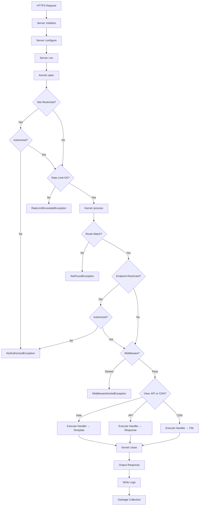

# Fast Raven Framework Documentation

**Fast Raven** is a **high-performance PHP** framework for building **fast, monolithic applications**. Optimized for **subdomain architectures**, it processes requests in **1ms** (average speed in shared hosting) while allowing fast-paced and easy development. No bloat. No magic. Just speed.

### Key Features

- **⚡ Performance**: Built for speed and efficiency.
- **🚀 Easy to use**: Zero-config setup, chainable methods, and one-file endpoints.
- **🔒 Security**: Built-in CSRF protection, secure session management, strict CSP with nonces, and automated HSTS headers.
- **🛣️ Routing**: High-speed O(1) hash map lookup with segregated API, View, and CDN routers.
- **🎯 Middlewares**: Granular per-endpoint request control for advanced flow management.
- **🔐 Auth**: Robust session-based authentication with automatic CSRF validation.
- **📊 Database**: PDO wrapper with prepared statements for ironclad SQL injection protection.
- **🎨 Templates**: Powerful template engine with view fragments, dynamic data passing, and asset versioning.
- **🌐 i18n**: Simple CSV-based translations with dynamic language switching per user preference.
- **📧 Email**: Integrated PHPMailer support with HTML templates and easy attachment handling.
- **📁 Files**: Secure file management with MIME validation via magic bytes and upload limits.
- **♻️ Caching**: Smart caching layer (APCu → shmop → file) with automatic fallback selection.
- **📝 Logging**: Comprehensive request logging with useful data in one-line format.

---

## 1. Request Lifecycle



### Execution Order Summary

1. **Server::initialize()** - Validates skeleton structure, loads `.env` files
2. **Server::configure()** - Creates Kernel with Config, Template, Middleware, and Routers
3. **Server::run()** - Main execution loop
4. **Kernel::open()** - Initializes Request, Services/Engines, handles site-level auth
5. **Kernel::process()** - Rate limiting, route matching, middleware execution, endpoint execution
6. **Kernel::close()** - Sends response, writes logs, garbage collection


---

## 2. Skeleton Structure

```
skeleton/
├── docs/                     Documentation
├── ops/                      Operations (scripts, etc.)
├── shared/                   Shared classes (Shared\ namespace)
└── sites/main/
    ├── config/
    │   ├── env/              env.php, env.php-example
    │   ├── router/           views.php, api.php, cdn.php
    │   ├── config.php        Main configuration
    │   ├── template.php      Default template
    │   └── middleware.php    Middleware definitions
    ├── src/
    │   ├── api/              API endpoint handlers
    │   ├── cdn/              CDN endpoint handlers
    │   ├── views/            View endpoint handlers
    │   └── web/
    │       ├── templates/    pages/, fragments/, mails/
    │       └── assets/       scss/, js/ (compiled via compile.sh)
    ├── public/assets/        css/, js/, img/, fonts/ (compiled output)
    ├── storage/              cache/, logs/, uploads/
    └── index.php             Entry point
```

---

## 3. Entry Point & Configuration

### index.php

The entry point initializes the server, configures it, and starts processing:

```php
<?php

declare(strict_types=1);

$startRequestTime = microtime(true);

require __DIR__ . "/../../vendor/autoload.php";

use FastRaven\Server;

// Server initialization. sitePath SHOULD ALWAYS BE __DIR__
// Pass $startRequestTime to include autoloading in performance metrics.
// Omit it (or pass null) to calculate time starting from framework initialization.
$server = Server::initialize(__DIR__, $startRequestTime);

// Server configuration
$server->configure(
    Server::getConfiguration(),
    Server::getTemplate(),
    Server::getMiddleware(),
    Server::getViewRouter(),
    Server::getApiRouter(),
    Server::getCdnRouter()
);

// Start request processing
$server->run();
```

---

### config.php

Main configuration for the site:

```php
<?php

use FastRaven\Components\Core\Config;

// Main Configuration. siteName is for identification, restricted = require auth for all pages
$config = Config::new("main", false);

// Cookie Session Configuration
// @param sessionName - Cookie name for session
// @param expiryDays - Session lifetime in days
// @param globalAuth - Share auth across subdomains (uses parent domain cookie)
$config->configureAuthorization("YOURSESSIONNAME", 7, false);

// Redirect settings for VIEW endpoints (API/CDN always return error responses)
// @param notFoundPath - Path to redirect on 404 (null = show custom error page)
// @param unauthorizedPath - Path to redirect on 401 (null = show custom error page)
// @param unauthorizedSubdomain - Subdomain redirect on 401 (null = use main domain, "" = empty string for main)
$config->configureRedirects("/", "/login", "");

// Privacy settings
// @param registerLogs - Enable request logging
// @param registerOrigin - Log IP addresses
$config->configurePrivacy(true, true);

// Rate limiting per middleware type (requests per minute, -1 = disabled)
$config->configureRateLimits(200, 200, 200);

// Input/file size limits in KB (-1 = disabled)
$config->configureLengthLimits(256, 5120);

// Cache garbage collection
// @param gcProbability - Probability % to run GC (0 = disabled)
// @param gcPower - Number of files to check per GC run
$config->configureCache(1, 50);

return $config;
```

---

### template.php

> [!IMPORTANT]
> **Asset Compilation Required**
> Fast Raven uses compiled assets for high performance. After modifying SCSS/JS in `src/web/assets` or updating the framework, you **MUST** run `./ops/compile.sh` to generate the production-ready files in `public/assets`.

Default template for all views:

```php
<?php

use FastRaven\Components\Core\Template;
use FastRaven\Bee;

// Default template for all views.
$template = Template::new("main.php", "Fast Raven Site", Bee::env("VERSION", "0.0.1"));
$template->setLangFile("global")           // CSV file in src/web/assets/lang/
         ->setDefaultLang("en")            // Default language column
         ->setFavicon("favicon.png")
         ->setBeforeFragments(["header.php"])
         ->addStyle("style.css")
         ->addScript("main.js");

return $template;
```

**Template Methods:**

| Method | Description |
|--------|-------------|
| `new(file, title, version)` | Create new template |
| `setFile/setTitle/setVersion` | Setters with chaining |
| `setFavicon(favicon)` | Set favicon for both light/dark mode from public/assets/img/ OR external URL (starts with https://) |
| `setFaviconLight/setFaviconDark(favicon)` | Set mode-specific favicons from public/assets/img/ OR external URL (starts with https://) |
| `setLangFile(filename)` | Set language CSV file (without .csv extension) |
| `setDefaultLang(lang)` | Set default language column to use |
| `addStyle(style)` | Add CSS file from public/assets/css/ OR external URL (starts with https://) |
| `addScript(script)` | Add JS file from public/assets/js/ OR external URL (starts with https://) |
| `setBeforeFragments(array)` | Fragments to render before main content |
| `setAfterFragments(array)` | Fragments to render after main content |
| `addData(key, value)` | Add data for template rendering |
| `getData(key)` | Get data value by key |
| `hasData(key)` | Check if data key exists |
| `setErrorFile(code, file)` | Set custom error page for HTTP status code |
| `getErrorFile(code)` | Get error page file for status code (default: "errors/generic.php") |
| `getNonce()` | Get CSP nonce for inline scripts |
| `merge(?Template)` | Merge another template (overwrites non-empty values) |

---

### Internationalization (i18n)

FastRaven provides built-in language support using CSV files:

**1. Create language file** at `src/web/assets/lang/global.csv`:
```csv
key,en,es,fr
WELCOME,Welcome,Bienvenido,Bienvenue
GOODBYE,Goodbye,Adiós,Au revoir
```

**2. Configure template** in `config/template.php`:
```php
$template->setLangFile("global")    // Uses src/web/assets/lang/global.csv
         ->setDefaultLang("en");    // Default language on page load
```

**3. Use in HTML** with `data-lang` attribute:
```html
<span data-lang="WELCOME"></span>
<p data-lang="GOODBYE"></p>
```

**4. Change language dynamically** via JavaScript:
```javascript
// Switch to Spanish
Lib.changeLanguage('es');

// Switch to English  
Lib.changeLanguage('en');

// Check current language
console.log(window.currentLanguage);  // Currently active language
```

**How it works:**
- On page load, `window.LANG_INTERNAL` is populated with all translations from the CSV
- The framework automatically restores the user's last selected language from `localStorage` (key: `activeLang`)
- If no language preference exists, defaults to the language set via `setDefaultLang()`
- `window.currentLanguage` contains the active language code
- `Lib.changeLanguage(lang)` updates all `data-lang` elements and persists the choice to `localStorage`
- **Performance:** Language data is cached for 24 hours to avoid re-parsing the CSV on every request
- **Persistence:** Language preference survives page reloads and browser sessions

---

### middleware.php

Middleware are reusable functions that can be attached to individual endpoints:

```php
<?php

use FastRaven\Services\LogService;
use FastRaven\Components\Http\Request;
use FastRaven\Components\Routing\Middleware;

// Create a new middleware holder instance.
$middleware = Middleware::new();

// Add middleware with a unique ID
$middleware->add("alwaysPass", function(Request $request): bool {
    LogService::log("Middleware executed for request");
    return true; // Return false to deny request (throws MiddlewareDeniedException)
});

$middleware->add("requireAdmin", function(Request $request): bool {
    // Example: Check if user has admin role
    // $userId = AuthService::getAuthorizedUserId();
    // return $userId && isAdmin($userId);
    return true;
});

return $middleware;
```

**Middleware Signature:**
- `function(Request $request): bool`
- Return `false` to deny request (throws `MiddlewareDeniedException`)

---

### Router Files

#### views.php (View Router)

```php
<?php

use FastRaven\Components\Routing\{Endpoint, Router};
use FastRaven\Types\EndpointType;

// View Router configuration. Each view must return a Template.
$viewRouter = Router::new(EndpointType::VIEW)
    ->add(Endpoint::view(false, "/", "Home.php"))
    ->add(Endpoint::view(true, "/dashboard", "Dashboard.php"))  // Restricted
    ->add(Endpoint::view(false, "/ping", "Ping.php", "alwaysPass"));  // With middleware

return $viewRouter;
```

#### api.php (API Router)

```php
<?php

use FastRaven\Components\Routing\{Endpoint, Router};
use FastRaven\Types\EndpointType;

// API Router - /api/ prefix is automatically added
$apiRouter = Router::new(EndpointType::API, 200)  // Rate limit: 200 req/min
    ->add(Endpoint::api(false, "GET", "/health", "Health.php"))
    ->add(Endpoint::api(false, "GET", "/pong", "Pong.php"))
    ->add(Endpoint::api(true, "POST", "/user/update", "user/Update.php"))  // Restricted
    ->add(Endpoint::api(false, "POST", "/login", "auth/Login.php", "guestOnly"));  // With middleware

return $apiRouter;
```

#### cdn.php (CDN Router)

```php
<?php

use FastRaven\Components\Routing\{Endpoint, Router};
use FastRaven\Types\EndpointType;

// CDN Router - /cdn/ prefix is automatically added
$cdnRouter = Router::new(EndpointType::CDN)
    ->add(Endpoint::cdn(false, "GET", "/favicon", "Favicon.php"));

return $cdnRouter;
```

---

### Endpoint Factory Methods

| Method | Signature | Description |
|--------|-----------|-------------|
| `view()` | `(restricted, path, file, ?middlewareId)` | View endpoint (returns Template) |
| `api()` | `(restricted, method, path, file, ?middlewareId)` | JSON API endpoint |
| `cdn()` | `(restricted, method, path, file, ?middlewareId)` | Binary/file endpoint |
| `router()` | `(type, restricted, path, routerFile, ?middlewareId)` | Nested router |

**Parameters:**
- `restricted` - Require authentication
- `middlewareId` - Optional ID of middleware to run before endpoint

**Router Constructor:**
- `Router::new(EndpointType $type, int $limitPerMinute = -1)` - Rate limiting is now set at the router level

---

## 4. Environment Variables

Environment variables are defined in `config/env/env.php` using the `Bee::defineEnv()` method.

```php
<?php

use FastRaven\Bee;

Bee::defineEnv("STATE", "dev"); // "dev" or "prod"
Bee::defineEnv("VERSION", "1.0.0");

if(Bee::isDev()) {
    // Development Variables
    Bee::defineEnv("SITE_ADDRESS", "fastraven.loc");
    Bee::defineEnv("AUTH_DOMAIN", ".fastraven.loc");
    
    // Database
    Bee::defineEnv("DB_HOST", "localhost");
    Bee::defineEnv("DB_PORT", "3306");
    Bee::defineEnv("DB_NAME", "test");
    Bee::defineEnv("DB_USER", "raven");
    Bee::defineEnv("DB_PASS", "secret");
    
    // ... other dev vars
} else {
    // Production Variables
    Bee::defineEnv("SITE_ADDRESS", "example.com");
    // ...
}
```

**Common Variables:**
- `STATE`: "dev" or "prod"
- `VERSION`: Application version (used for cache busting)
- `SITE_ADDRESS`: Base domain
- `AUTH_DOMAIN`: Cookie domain
- `DB_HOST`, `DB_PORT`, `DB_NAME`, `DB_USER`, `DB_PASS`: Database credentials
- `DB_PERSISTENT`: "true" or "false"
- `DB_SSL`: "true" or "false"
- `SMTP_HOST`, `SMTP_PORT`, `SMTP_USER`, `SMTP_PASS`: Mail credentials
- `SHMOP_MAX_SIZE`: Max shared memory cache size in KB

---

## 5. Services (Public API)

Services are the public API for interacting with framework functionality.

### Bee (Utilities)

```php
use FastRaven\Bee;

// Environment
$host = Bee::env("DB_HOST", "localhost");  // Get env var with default
Bee::defineEnv("MY_VAR", "value");         // Set env var (used in env.php)
$isDev = Bee::isDev();                     // Check if STATE === "dev"

// Paths
$path = Bee::buildProjectPath(ProjectFolderType::CONFIG, "config.php");
$safe = Bee::normalizePath("../etc/passwd");  // → "etc/passwd"

// Security
$hash = Bee::hashPassword("secret");          // Argon2ID hashing

// Files
$mime = Bee::getFileMimeType("/path/to/file");           // Returns MIME string
$type = Bee::getFileMimeType("/path/to/file", true);     // Returns DataType enum

// Domain
$domain = Bee::getBaseDomain();                  // From SITE_ADDRESS
$full = Bee::getBuiltDomain("admin");            // "admin.example.com"

// Callable validation
$valid = Bee::validateCallable($callable, [Request::class, Template::class]);

// CSV parsing (for i18n)
$langs = Bee::parseCSV(
    Bee::buildProjectPath(
        ProjectFolderType::SRC_WEB_ASSETS_LANG,
        "global.csv"
    )
);  // Returns ["en" => ["KEY" => "value"], ...]

// Cache Keys (includes project version for automatic cache invalidation)
$key = Bee::getCacheKey("session", "user_1"); // → "fastraven:example.com:session:0.0.1:hash"
```

---

### AuthService

```php
use FastRaven\Services\AuthService;

// Create session
AuthService::createAuthorization($userId, ["role" => "admin"]);

// Check authorization
AuthService::isAuthorized($request);      // Includes CSRF check for POST/PUT/DELETE/PATCH
AuthService::isAuthorized();              // Session only (no CSRF check)
$userId = AuthService::getAuthorizedUserId();  // int or null

// Destroy session
AuthService::destroyAuthorization();

// Regenerate CSRF token (invalidates other tabs)
$newToken = AuthService::regenerateCSRF();

// Auto-login from database
AuthService::autologin(
    $username, 
    $password, 
    "users",      // table
    "id",         // id column
    "username",   // username column
    "password"    // password column (Argon2ID hashed)
);
```

**Session Variables:**
- `$_SESSION["sgas_uid"]` - User ID
- `$_SESSION["sgas_custom"]` - Custom data array
- `$_SESSION["sgas_csrf"]` - CSRF token

---

### DataService

> ⚠️ Only `Map` values are protected via prepared statements. Never use user input for table/column names.

```php
use FastRaven\Services\DataService;
use FastRaven\Components\Data\{Map, ConditionList, Condition, Pair};
use FastRaven\Types\OperatorType;

// Raw SQL (CAREFUL: No SQL protection provided by the framework from hereon!)
$result = DataService::sql("SELECT * FROM users WHERE id = ?", [$id]);

// Read single row
$user = DataService::selectOneById("users", ["id", "name"], 1);
$user = DataService::selectOneWhere("users", ["*"], ConditionList::new([
    Condition::email("email", $email)
]));

// Read multiple rows
$users = DataService::selectWhere(
    "users", 
    ["id", "name"], 
    ConditionList::new([Condition::equals("active", 1)]),
    "name ASC",  // orderBy
    10,          // limit
    0            // offset
);
$allUsers = DataService::select("users", ["*"], "created_at DESC", 100, 0);

// Joins
// Simple join
$join = DataService::join(
    "users",
    ["orders"],
    Map::new(["users.id" => "orders.user_id"]),
    ["users.name", "orders.total"]
);

// Join with WHERE clauses
$joinFiltered = DataService::joinWhere(
    "users",
    ["orders"],
    Map::new(["users.id" => "orders.user_id"]),
    ["users.name", "orders.total"],
    ConditionList::new([Condition::equals("users.active", 1)])
);

// Insert
DataService::insert("users", Map::new([
    "name" => "John",
    "email" => "john@example.com"
]));
$id = DataService::getLastInsertId();

// Batch insert (single transaction)
DataService::insertBatch("logs", [
    Map::new(["action" => "login"]),
    Map::new(["action" => "logout"])
]);

// Update
DataService::updateById("users", 1, Map::new([
    "name" => "Jane"
]));
DataService::updateWhere("users", 
    Map::new(["active" => 0]),
    ConditionList::new([Condition::equals("old", 1)])
);

// Delete
DataService::deleteById("users", 1);
DataService::deleteWhere("users", ConditionList::new([Condition::equals("expired", 1)]));

// Count/Exists
$count = DataService::count("users", ConditionList::new([Condition::equals("active", 1)]));
$exists = DataService::existsById("users", 1);
```

---

### ValidationService

```php
use FastRaven\Services\ValidationService;
use FastRaven\Components\Data\ValidationFlags;

// Email validation
ValidationService::email($email);  // Uses filter_var

// String validation (replaces username, password, etc.)
ValidationService::string($text, [
    ValidationType::MIN_LENGTH->value => 8,
    ValidationType::MAX_LENGTH->value => 128,
    ValidationType::MIN_DIGITS->value => 1,
    ValidationType::MIN_SPECIAL->value => 1,
    ValidationType::MIN_LOWERCASE->value => 1,
    ValidationType::MIN_UPPERCASE->value => 1
]);

// Number validation (replaces age, etc.)
ValidationService::number($age, [
    ValidationType::MIN_NUMBER->value => 18,
    ValidationType::MAX_NUMBER->value => 120
]);

// Phone validation
ValidationService::phone($countryCode, $phone);  // 7-15 chars, code 1-999
```

---

### CacheService

Automatically selects best backend: APCu → shmop → file.

```php
use FastRaven\Services\CacheService;

CacheService::write("key", $value, 3600);  // TTL in seconds
$value = CacheService::read("key");        // null if expired/missing
CacheService::remove("key");
CacheService::increment("counter", 1);     // Atomic increment
CacheService::empty();                     // Clear all cache
```

---

### FileService

Manages files in `storage/uploads/`.

```php
use FastRaven\Services\FileService;

// Upload (from Request)
$file = $request->file("avatar");  // Returns File object
FileService::upload($file, "avatars/user_123.jpg");

// Read/Check/Delete
$content = FileService::read("documents/file.txt");
$exists = FileService::exists("path/to/file");
FileService::delete("path/to/file");

// Get full path
$fullPath = FileService::getUploadFilePath("path/to/file");
```

---

### LogService

Logs to `storage/logs/YYYY-MM-DD.log`.

```php
use FastRaven\Services\LogService;

LogService::log("User logged in");        // Normal log
LogService::warning("Invalid input");     // //WARN// prefix
LogService::error("Database failed");     // //ERROR// prefix
LogService::debug("Debug info");          // /SG/ prefix, dev only
```

---

### MailService

Sends emails using PHPMailer with SMTP. Configure SMTP settings in `.env`.

```php
use FastRaven\Services\MailService;
use FastRaven\Components\Core\Mail;
use FastRaven\Components\Data\{Map, Pair};

$mail = Mail::new(
    Pair::mail("Site", "noreply@example.com"),   // From
    Pair::mail("User", "user@example.com"),      // To
    "Welcome!",                                  // Subject
    "welcome.php"                                // Template in src/web/templates/mails/
);

$mail->setReplaceValues(Map::new([
    "{{NAME}}" => "John",
    "{{LINK}}" => "https://example.com/verify"
]));

// Optional: Add BCC recipients
$mail->setBccMails(Map::new([
    "Admin" => "admin@example.com"
]));

// Optional: Add attachments (relative to storage/uploads/)
$mail->setAttachments(Map::new([
    "report.pdf" => "documents/report.pdf"
]));

// Optional: Set timeout (default 3000ms)
$mail->setTimeout(5000);

// Send synchronously - blocks until sent, returns success/failure
MailService::send($mail);

// Send async (fire-and-forget) - queued, sent after response
// Use for notifications that don't need confirmation
MailService::send($mail, true);
```

**Sending Modes:**

| Mode | Usage | Blocks? | Returns |
|------|-------|---------|---------|
| `send($mail)` | Registration, password reset | Yes | `bool` (success) |
| `send($mail, true)` | Notifications, alerts | No | `bool` (queued) |

Fire-and-forget emails are processed after `fastcgi_finish_request()`, so the user receives their response immediately while emails are sent in the background.

**Mail Templates:**
- Location: `src/web/templates/mails/`
- Format: HTML files with placeholder support (e.g., `{{PLACEHOLDER}}`)
- Placeholders are replaced using `setReplaceValues()`

---

### HeaderService

```php
use FastRaven\Services\HeaderService;

HeaderService::addHeader("X-Custom", "value");
HeaderService::removeHeader("X-Custom");
```

**Auto-set security headers:** CSP, HSTS, X-Frame-Options, X-Content-Type-Options, Referrer-Policy.

---

## 6. Components

### Request

```php
$request->getType();              // EndpointType::VIEW/API/CDN
$request->getMethod();            // GET, POST, PUT, DELETE, PATCH
$request->getPath();              // /api/users/
$request->getComplexPath();       // /api/users/#POST (for routing)
$request->getInternalID();        // 8-char hex request ID
$request->getRemoteAddress();     // Client IP

// Query params (?key=value)
$value = $request->get("key", SanitizeType::SAFE);

// Body params (JSON or form data)
$value = $request->post("key", SanitizeType::SANITIZED);

// File uploads
$file = $request->file("avatar");  // Returns File object or null
```

---

### Response

```php
// Standard JSON response
Response::new(true, 200, "Success", ["id" => 1]);
Response::new(false, 400, "Invalid input");

// File response (for CDN endpoints)
Response::file(true, "path/in/uploads");  // Relative to storage/uploads/

// Chained setters
Response::new(true, 200)
    ->setMessage("Updated")
    ->setData(["count" => 5])
    ->setDataType(DataType::JSON);
```

**JSON output format:**
```json
{
    "success": true,
    "msg": "Success",
    "data": {"id": 1}
}
```

---

### Map & Pair

O(1) hash map for type-safe key-value pairs:

```php
use FastRaven\Components\Data\{Map, Pair};

// Map replaces Collection and uses associative internal storage
$map = Map::new([
    "email" => "john@example.com",
    "name" => "John"
]);

// Add/Get/Set/Remove
$map->add("age", 25);
$value = $map->get("email");      // mixed value or null (not an object)
$map->set("email", "jane@example.com");
$map->remove("age");

// Pair is mostly used for specific strict-typed returns or specific APIs like Mail
$mailPair = Pair::mail("John Doe", "john@example.com");
```

---

### File

Represents an uploaded file from request:

```php
use FastRaven\Components\Core\File;

$file = $request->file("avatar");  // Returns File or null

// Properties
$file->getPath();       // Temporary path (e.g., /tmp/phpXXXX)
$file->getName();       // Original filename (e.g., "photo.jpg")
$file->getExtension();  // File extension (e.g., "jpg")

// Usage with FileService
FileService::upload($file, "avatars/" . $file->getName());
```

---

### Mail

Email configuration for MailService:

```php
use FastRaven\Components\Core\Mail;
use FastRaven\Components\Data\{Collection, Item};

$mail = Mail::new(
    Item::mail("Site Name", "noreply@example.com"),  // From
    Item::mail("User Name", "user@example.com"),     // To
    "Welcome to our site!",                          // Subject
    "welcome.php"                                    // Template in src/web/templates/mails/
);

// All available setters (chainable)
$mail
    ->setOrigin(Item::mail("New Sender", "new@example.com"))
    ->setDestination(Item::mail("New Recipient", "recipient@example.com"))
    ->setSubject("Updated Subject")
    ->setBodyFile("other-template.html")
    ->setReplaceValues(Collection::new([
        Item::new("{{NAME}}", "John"),
        Item::new("{{LINK}}", "https://example.com/verify")
    ]))
    ->setBccMails(Collection::new([
        Item::mail("Admin", "admin@example.com"),
        Item::mail("Manager", "manager@example.com")
    ]))
    ->setAttachments(Collection::new([
        Item::new("invoice.pdf", "/path/to/invoice.pdf")
    ]))
    ->setTimeout(5000);  // Timeout in ms (default: 3000)
```

---

### Validation usage
Use `ValidationType` enum values as keys for configuration arrays:

```php
use FastRaven\Types\ValidationType;
use FastRaven\Services\ValidationService;

// String flags
$flags = [
    ValidationType::MIN_LENGTH->value => 8,      // Default: 0
    ValidationType::MAX_LENGTH->value => 255,    // Default: 255
    ValidationType::MIN_DIGITS->value => 1,      // Default: 0
    ValidationType::MIN_SPECIAL->value => 1,     // Default: 0
    ValidationType::MIN_LOWERCASE->value => 1,   // Default: 0
    ValidationType::MIN_UPPERCASE->value => 1    // Default: 0
];

// Number flags
$numberFlags = [
    ValidationType::MIN_NUMBER->value => 18,   // Default: 0
    ValidationType::MAX_NUMBER->value => 120   // Default: 255
];

// Usage with ValidationService:
$details = [];
if (!ValidationService::string($pass, [
    ValidationType::MIN_LENGTH->value => 8, 
    ValidationType::MIN_DIGITS->value => 1, 
    ValidationType::MIN_SPECIAL->value => 1
], $details)) {
    // $details contains specific boolean results for each check
    // e.g., $details[ValidationType::MIN_LENGTH->value] === false
    return Response::new(false, 400, "Password requirements not met", $details);
}
```

---

## 7. Types (`FastRaven\Types`)

### ProjectFolderType

Used with `Bee::buildProjectPath()` for type-safe path construction.

| Case | Path |
|------|------|
| `CONFIG` | `config/` |
| `CONFIG_ENV` | `config/env/` |
| `CONFIG_ROUTER` | `config/router/` |
| `PUBLIC` | `public/` |
| `PUBLIC_ASSETS` | `public/assets/` |
| `PUBLIC_ASSETS_CSS` | `public/assets/css/` |
| `PUBLIC_ASSETS_JS` | `public/assets/js/` |
| `PUBLIC_ASSETS_IMG` | `public/assets/img/` |
| `PUBLIC_ASSETS_FONTS` | `public/assets/fonts/` |
| `SRC` | `src/` |
| `SRC_VIEWS` | `src/views/` |
| `SRC_API` | `src/api/` |
| `SRC_CDN` | `src/cdn/` |
| `SRC_WEB` | `src/web/` |
| `SRC_WEB_TEMPLATES` | `src/web/templates/` |
| `SRC_WEB_TEMPLATES_FRAGMENTS` | `src/web/templates/fragments/` |
| `SRC_WEB_TEMPLATES_MAILS` | `src/web/templates/mails/` |
| `SRC_WEB_TEMPLATES_PAGES` | `src/web/templates/pages/` |
| `SRC_WEB_ASSETS` | `src/web/assets/` |
| `SRC_WEB_ASSETS_SCSS` | `src/web/assets/scss/` |
| `SRC_WEB_ASSETS_JS` | `src/web/assets/js/` |
| `STORAGE` | `storage/` |
| `STORAGE_CACHE` | `storage/cache/` |
| `STORAGE_LOGS` | `storage/logs/` |
| `STORAGE_UPLOADS` | `storage/uploads/` |

---

### SanitizeType

Input sanitization levels (use with `$request->get()` / `$request->post()`):

| Level | Effect |
|-------|--------|
| `RAW` | No sanitization |
| `SAFE` | Strips null bytes, PHP tags |
| `ENCODED` | SAFE + `htmlspecialchars()` |
| `SANITIZED` | SAFE + `strip_tags()` |
| `ONLY_ALPHA` | SANITIZED + alphanumeric only |

---

### Other Enums

| Enum | Values |
|------|--------|
| `EndpointType` | VIEW, API, CDN, ROUTER |
| `CacheType` | APCU, SHARED, FILE |
| `QueryType` | SELECT, INSERT, UPDATE, DELETE, COUNT |
| `DataType` | 55+ MIME types (HTML, JSON, PNG, PDF, etc.) |
| `ValidationType` | MIN_LENGTH, MAX_LENGTH, MIN_DIGITS, MIN_FLOAT, etc. |

---

## 8. Exceptions

All exceptions extend `SmartException` with `getStatusCode()`, `getMessage()`, `getPublicMessage()`, and `getExceptionName()`.

| Exception | Code | Description |
|-----------|------|-------------|
| `SmartException` | - | Base class for all framework exceptions |
| `NotFoundException` | 404 | Route not found |
| `NotAuthorizedException` | 401 | Auth required |
| `NotAuthorizedException(true)` | 401 | Subdomain redirect |
| `BadMiddlewareException` | 500 | Middleware has incorrect signature |
| `MiddlewareDeniedException` | 400 | Middleware rejected request |
| `RateLimitExceededException` | 429 | Rate limit exceeded, includes Retry-After header |
| `BadImplementationException` | 500 | Endpoint doesn't return correct type |
| `EndpointFileNotFoundException` | 500 | Endpoint file missing |
| `UploadedFileNotFoundException` | 500 | Uploaded file not in tmp directory |
| `BadProjectSkeletonException` | 500 | Required project folder missing |
| `SecurityVulnerabilityException` | 500 | SQL injection detected |
| `DeveloperException` | 500 | Developer mistake on View/API/CDN endpoints |

---

## 9. View Endpoint Example

View endpoints now use PHP handler files that return a `Template` object:

```php
<?php
// src/views/Dashboard.php

use FastRaven\Components\Core\Template;
use FastRaven\Components\Http\Request;
use FastRaven\Components\Data\Item;
use FastRaven\Services\AuthService;
use FastRaven\Services\DataService;

return function(Request $request, Template $baseTemplate): Template {
    // Get user data
    $userId = AuthService::getAuthorizedUserId();
    $user = DataService::selectOneById("users", ["name", "notifications"], $userId);
    
    // Create page-specific template
    $page = Template::new("dashboard.php", "Dashboard");
    
    // Add dynamic data for the template
    $page->addData("username", $user["name"]);
    $page->addData("notifications", $user["notifications"]);
    
    return $page;
};
```

**Template file** (`src/web/templates/pages/dashboard.php`):
```php
<h1>Welcome, <?= $template->getData("username") ?></h1>
<p>You have <?= $template->getData("notifications") ?> notifications</p>

<!-- Inline script with nonce -->
<script nonce="<?= $template->getNonce() ?>">
    console.log("Dashboard loaded");
</script>
```

**Handler Signature:**
- `function(Request $request, Template $baseTemplate): Template`
- `$baseTemplate` is the default template from `config/template.php`
- Return a new Template that will be merged with the base template

---

## 10. API Endpoint Example

Complete example of an API endpoint:

```php
<?php
// src/api/user/Update.php

use FastRaven\Components\Http\{Request, Response};
use FastRaven\Services\{AuthService, DataService, ValidationService};
use FastRaven\Components\Data\{Collection, Item, ValidationFlags};
use FastRaven\Types\SanitizeType;

return function(Request $request): Response {
    // Get authenticated user
    $userId = AuthService::getAuthorizedUserId();
    if (!$userId) {
        return Response::new(false, 401, "Not authorized");
    }
    
    // Get and sanitize input
    $name = $request->post("name", SanitizeType::SANITIZED);
    $email = $request->post("email", SanitizeType::SAFE);
    
    // Validate input
    if (!ValidationService::username($name, ValidationFlags::username(3, 50))) {
        return Response::new(false, 400, "Invalid name");
    }
    if (!ValidationService::email($email)) {
        return Response::new(false, 400, "Invalid email");
    }
    
    // Check if email already exists
    $existing = DataService::selectOneWhere("users", ["id"], Collection::new([
        Item::new("email", $email)
    ]));
    if ($existing && $existing["id"] !== $userId) {
        return Response::new(false, 409, "Email already in use");
    }
    
    // Update user
    DataService::updateById("users", $userId, Collection::new([
        Item::new("name", $name),
        Item::new("email", $email)
    ]));
    
    return Response::new(true, 200, "Profile updated");
};
```

---

## 11. CDN Endpoint Example

CDN endpoints serve files (images, documents, etc.) from storage:

```php
<?php
// src/cdn/Avatar.php

use FastRaven\Components\Http\{Request, Response};
use FastRaven\Services\FileService;

return function(Request $request): Response {
    $userId = $request->get("id", SanitizeType::ONLY_ALPHA);
    
    if (!$userId) {
        return Response::new(false, 400, "Missing user ID");
    }
    
    $avatarPath = "avatars/user_{$userId}.jpg";
    
    if (!FileService::exists($avatarPath)) {
        return Response::file(true, "avatars/default.jpg");
    }
    
    return Response::file(true, $avatarPath);
};
```

**CDN router entry:**
```php
->add(Endpoint::cdn(false, "GET", "/avatar", "Avatar.php"))
// Access: GET /cdn/avatar/?id=123
```

---

## 12. Nested Router Example

For organizing large applications, use nested routers:

```php
// config/router/api.php (main router)
use FastRaven\Components\Routing\{Router, Endpoint};
use FastRaven\Types\EndpointType;

$apiRouter = Router::new(EndpointType::API)
    ->add(Endpoint::api(false, "GET", "/health", "Health.php"))
    // Nested router for all /api/admin/* endpoints
    ->add(Endpoint::router(EndpointType::API, true, "/admin", "admin.php"));

return $apiRouter;
```

```php
// config/router/admin.php (nested router)
use FastRaven\Components\Routing\{Router, Endpoint};
use FastRaven\Types\EndpointType;

// All endpoints here are already under /api/ and restricted
$adminRouter = Router::new(EndpointType::API)
    ->add(Endpoint::api(false, "GET", "/admin/users", "admin/Users.php"))
    ->add(Endpoint::api(false, "POST", "/admin/ban", "admin/Ban.php"));

return $adminRouter;
```

**Result:**
- `GET /api/admin/users/` → `admin/Users.php` (restricted)
- `POST /api/admin/ban/` → `admin/Ban.php` (restricted)

---

## 13. Error Handling

### Custom Error Pages (Views Only)

For VIEW endpoints, you can customize error pages for different HTTP status codes instead of redirecting:

**1. Create error page templates** in `src/web/templates/pages/errors/`:

```php
<!-- src/web/templates/pages/errors/not-found.php -->
<div class="error-container">
    <h1>404 - Page Not Found</h1>
    <p><?= $template->getData("errorMessage") ?></p>
    <p>Error Code: <?= $template->getData("errorCode") ?></p>
    <a href="/">Return Home</a>
</div>
```

**2. Configure custom error pages** in `config/template.php`:

```php
$template = Template::new("main.php", "Fast Raven Site", Bee::env("VERSION", "0.0.1"))
    ->setErrorFile(404, "errors/not-found.php")
    ->setErrorFile(401, "errors/unauthorized.php")
    ->setErrorFile(500, "errors/server-error.php");
```

**3. Choose between redirects or error pages** in `config/config.php`:

```php
// Option A: Redirect to paths (traditional behavior)
$config->configureRedirects("/", "/login", null);

// Option B: Show custom error pages (no redirects)
$config->configureRedirects(null, null, null);

// Option C: Mix (show 404 page, redirect 401 to login)
$config->configureRedirects(null, "/login", null);
```

**Available template data in error pages:**
- `errorCode` - HTTP status code (e.g., 404, 401, 500)
- `errorMessage` - Public error message from exception

**Notes:**
- Error pages only apply to VIEW endpoints (API/CDN always return JSON/file responses)
- Redirects take precedence over error pages when configured (returns 302 redirect)
- Default error page is `errors/generic.php` if no custom page is set via `setErrorFile()`
- Error pages receive the base template

---

### Throwing Exceptions in Endpoints

```php
use FastRaven\Exceptions\NotFoundException;
use FastRaven\Exceptions\NotAuthorizedException;

return function(Request $request): Response {
    $id = $request->post("id", SanitizeType::ONLY_ALPHA);
    
    // 404 - Resource not found
    $item = DataService::selectOneById("items", ["*"], intval($id));
    if (!$item) {
        throw new NotFoundException();
    }
    
    // 401 - Not authorized (redirects to login for views)
    if ($item["owner_id"] !== AuthService::getAuthorizedUserId()) {
        throw new NotAuthorizedException();
    }
    
    // 401 with subdomain redirect
    if ($item["requires_premium"]) {
        throw new NotAuthorizedException(true);  // Redirects to premium subdomain
    }
    
    return Response::new(true, 200, "OK", $item);
};
```

### Custom Error Responses

For API endpoints, return Response objects instead of throwing exceptions:

```php
return function(Request $request): Response {
    $userId = AuthService::getAuthorizedUserId();
    if (!$userId) {
        return Response::new(false, 401, "Please log in to continue");
    }
    
    $data = $request->post("data", SanitizeType::SAFE);
    if (!$data) {
        return Response::new(false, 400, "Missing required field: data");
    }
    
    if (strlen($data) > 1000) {
        return Response::new(false, 413, "Data exceeds maximum length");
    }
    
    // Process...
    return Response::new(true, 200, "Success");
};
```

---

## 14. JavaScript Client (Lib)

The framework injects `Lib` class into all views with CSRF token handling.

### Lib.request()

```javascript
// GET request
Lib.request("/api/users/", "GET")
    .then(res => console.log(res.success, res.msg, res.data));

// POST with data
Lib.request("/api/user/update/", "POST", { name: "John" })
    .then(res => console.log(res));
```

### Lib.uploadFile()

```javascript
// Default field name: 'file'
Lib.uploadFile("/api/upload/", document.getElementById("fileInput"))
    .then(res => console.log(res));

// Custom field name
Lib.uploadFile("/api/upload/", fileInput, "avatar")
    .then(res => console.log(res));

// With extra data
Lib.uploadFile("/api/upload/", fileInput, "document", { category: "pdf" })
    .then(res => console.log(res));
```

**Backend handling:**
```php
return function(Request $request): Response {
    $file = $request->file("avatar");
    if (!$file) {
        return Response::new(false, 400, "No file uploaded");
    }
    
    FileService::upload($file, "avatars/" . $file->getName());
    return Response::new(true, 200, "Uploaded");
};
```

---

## 15. Shared Classes

Create reusable classes in `shared/` available across all sites via the `Shared\` namespace:

```php
// shared/HelperClass.php
namespace Shared;

final class HelperClass {
    public static function formatCurrency(float $amount): string {
        return number_format($amount, 2, ',', '.') . ' €';
    }
}
```

```php
// Usage in any endpoint
use Shared\HelperClass;

$price = HelperClass::formatCurrency(99.99);  // "99,99 €"
```

---

## 16. Directory Structure (Framework)

```
framework/src/
├── Components/           # Public components
│   ├── Core/             Config, Template, Mail, File
│   ├── Data/             Collection, Item, ValidationFlags
│   ├── Http/             Request, Response
│   └── Routing/          Router, Endpoint, Middleware
├── Exceptions/           # SmartException and 11 subclasses
├── Internals/             # Kernel, Engines (not for direct use)
├── Services/              # Public API (9 services)
│   ├── AuthService.php
│   ├── CacheService.php
│   ├── DataService.php
│   ├── FileService.php
│   ├── HeaderService.php
│   ├── LogService.php
│   ├── MailService.php
│   └── ValidationService.php
├── Types/                # Enums (6 types)
├── Bee.php               # Utilities
└── Server.php            # Entry point
```

---

## 17. Testing

```bash
cd framework
composer test
# or: ./vendor/bin/phpunit
```

---

## License

MIT License
